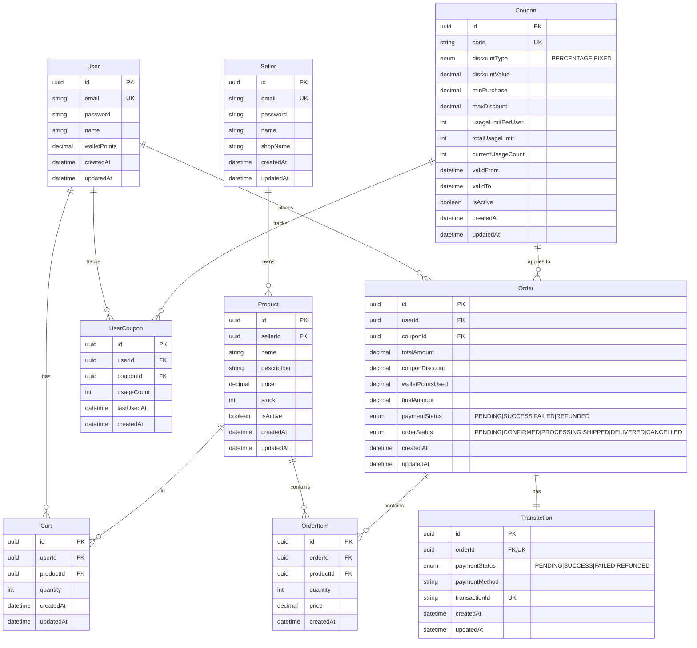

# Database Schema - E-Commerce API

This document contains the visual database schema using Mermaid diagrams. View this file on GitHub or any Mermaid-compatible viewer to see the diagrams rendered.

## Entity Relationship Diagram



## Table Descriptions

### Core Entities

#### User Table
The main user table storing customer information and wallet balance.
- **Primary Key**: id (uuid)
- **Unique Constraints**: email
- **Relations**: Has many Carts, Orders, and UserCoupons

#### Seller Table
Stores seller/vendor information who manage products.
- **Primary Key**: id (uuid)
- **Unique Constraints**: email
- **Relations**: Has many Products

#### Product Table
Product catalog with pricing and inventory.
- **Primary Key**: id (uuid)
- **Foreign Keys**: sellerId → Seller
- **Soft Delete**: Uses isActive flag
- **Relations**: Belongs to Seller, has many Cart items and OrderItems

### Shopping & Orders

#### Cart Table
Shopping cart with temporary product selections.
- **Primary Key**: id (uuid)
- **Foreign Keys**: userId → User, productId → Product
- **Unique Constraints**: (userId, productId)
- **Relations**: Belongs to User and Product

#### Order Table
Completed order information with payment details.
- **Primary Key**: id (uuid)
- **Foreign Keys**: userId → User, couponId → Coupon (optional)
- **Relations**: Belongs to User, optionally to Coupon; has many OrderItems and one Transaction

#### OrderItem Table
Line items in an order with price snapshot.
- **Primary Key**: id (uuid)
- **Foreign Keys**: orderId → Order, productId → Product
- **Relations**: Belongs to Order and Product

#### Transaction Table
Payment transaction records linked to orders.
- **Primary Key**: id (uuid)
- **Foreign Keys**: orderId → Order (unique, 1:1)
- **Unique Constraints**: orderId, transactionId
- **Relations**: Belongs to Order (one-to-one)

### Discount System

#### Coupon Table
Discount coupons with usage tracking and limits.
- **Primary Key**: id (uuid)
- **Unique Constraints**: code
- **Types**: PERCENTAGE or FIXED discount
- **Limits**: Global usage limit and per-user usage limit
- **Relations**: Has many UserCoupons and Orders

#### UserCoupon Table
Tracks individual user's coupon usage.
- **Primary Key**: id (uuid)
- **Foreign Keys**: userId → User, couponId → Coupon
- **Unique Constraints**: (userId, couponId)
- **Relations**: Belongs to User and Coupon

## Relationship Cardinalities

### One-to-Many (1:N)
| Parent | Child | Description |
|--------|-------|-------------|
| User | Cart | A user can have multiple cart items |
| User | Order | A user can place multiple orders |
| User | UserCoupon | A user can use multiple coupons |
| Seller | Product | A seller can have multiple products |
| Product | Cart | A product can be in multiple users' carts |
| Product | OrderItem | A product can be in multiple orders |
| Coupon | UserCoupon | A coupon can be used by multiple users |
| Coupon | Order | A coupon can be applied to multiple orders |
| Order | OrderItem | An order contains multiple products |

### One-to-One (1:1)
| Entity 1 | Entity 2 | Description |
|----------|----------|-------------|
| Order | Transaction | Each order has exactly one transaction record |

### Many-to-One (N:1)
All the inverse relationships of the One-to-Many relationships listed above.

## Key Design Decisions

### 1. Soft Deletes
Products use the `isActive` boolean flag instead of hard deletion to:
- Preserve order history
- Maintain referential integrity
- Allow reactivation if needed

### 2. Price Snapshots
OrderItem stores the price at the time of purchase to:
- Maintain accurate historical records
- Handle price changes after order placement
- Support refunds and returns

### 3. Composite Unique Keys
- **Cart**: (userId, productId) - One product per user in cart
- **UserCoupon**: (userId, couponId) - Track each user-coupon combination

### 4. Optional Relationships
- Order.couponId is optional (orders without coupons)
- Transaction.paymentMethod is optional (pending payments)
- Transaction.transactionId is optional (before payment gateway response)

### 5. Usage Tracking
- **Coupon.currentUsageCount**: Global usage across all users
- **UserCoupon.usageCount**: Per-user usage tracking
- **UserCoupon.lastUsedAt**: Timestamp of last usage

### 6. Wallet Points
- Stored as Decimal(10,2) for precision
- Managed at User level
- Applied after coupon discount
- Automatically restored on payment failure

## Indexes

Performance-critical indexes:
```sql
-- User indexes
CREATE INDEX idx_users_email ON users(email);

-- Product indexes
CREATE INDEX idx_products_seller_id ON products(seller_id);
CREATE INDEX idx_products_is_active ON products(is_active);

-- Cart indexes
CREATE INDEX idx_cart_user_id ON cart(user_id);

-- Order indexes
CREATE INDEX idx_orders_user_id ON orders(user_id);
CREATE INDEX idx_orders_payment_status ON orders(payment_status);
CREATE INDEX idx_orders_order_status ON orders(order_status);

-- OrderItem indexes
CREATE INDEX idx_order_items_order_id ON order_items(order_id);
CREATE INDEX idx_order_items_product_id ON order_items(product_id);

-- Coupon indexes
CREATE INDEX idx_coupons_code ON coupons(code);
CREATE INDEX idx_coupons_is_active ON coupons(is_active);

-- UserCoupon indexes
CREATE INDEX idx_user_coupons_user_id ON user_coupons(user_id);
CREATE INDEX idx_user_coupons_coupon_id ON user_coupons(coupon_id);

-- Transaction indexes
CREATE INDEX idx_transactions_transaction_id ON transactions(transaction_id);
```

## Database Constraints

### Foreign Key Constraints

#### ON DELETE Behaviors
- **Cart → User**: CASCADE (delete cart when user deleted)
- **Cart → Product**: CASCADE (delete cart items when product deleted)
- **Order → User**: RESTRICT (prevent user deletion if orders exist)
- **Order → Coupon**: SET NULL (keep order if coupon deleted)
- **OrderItem → Order**: CASCADE (delete items when order deleted)
- **OrderItem → Product**: RESTRICT (prevent product deletion if in orders)
- **Transaction → Order**: CASCADE (delete transaction when order deleted)
- **UserCoupon → User**: CASCADE (delete usage when user deleted)
- **UserCoupon → Coupon**: RESTRICT (prevent coupon deletion if used)
- **Product → Seller**: RESTRICT (prevent seller deletion if products exist)

### Check Constraints
```sql
-- Ensure positive values
ALTER TABLE products ADD CONSTRAINT check_price_positive CHECK (price >= 0);
ALTER TABLE products ADD CONSTRAINT check_stock_non_negative CHECK (stock >= 0);
ALTER TABLE cart ADD CONSTRAINT check_quantity_positive CHECK (quantity > 0);
ALTER TABLE order_items ADD CONSTRAINT check_quantity_positive CHECK (quantity > 0);
ALTER TABLE orders ADD CONSTRAINT check_amounts_non_negative CHECK (
    total_amount >= 0 AND
    coupon_discount >= 0 AND
    wallet_points_used >= 0 AND
    final_amount >= 0
);

-- Ensure discount logic
ALTER TABLE coupons ADD CONSTRAINT check_discount_value_positive CHECK (discount_value > 0);
ALTER TABLE coupons ADD CONSTRAINT check_usage_counts CHECK (current_usage_count >= 0);
```

## Viewing This Diagram

This Mermaid diagram will render automatically on:
- **GitHub** - View this file on GitHub to see the rendered diagram
- **GitLab** - Supports Mermaid rendering in markdown
- **VS Code** - Install "Markdown Preview Mermaid Support" extension
- **Obsidian** - Native Mermaid support
- **Notion** - Copy and paste into a code block with language set to "mermaid"
- **Online Viewers**:
  - https://mermaid.live/
  - https://mermaid.ink/

## Related Documentation

- [Main README](./README.md) - Complete API documentation
- [Prisma Schema](./src/prisma/schema.prisma) - Actual database schema definition
